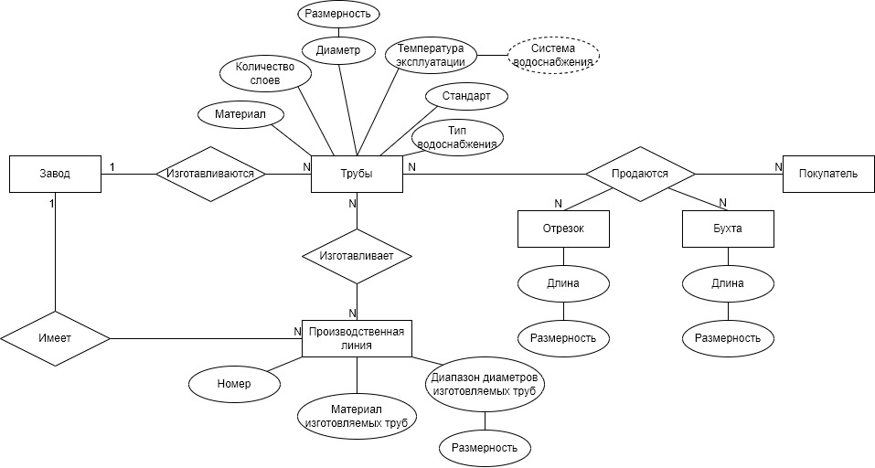
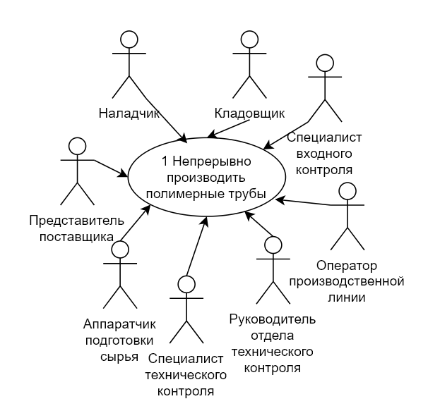
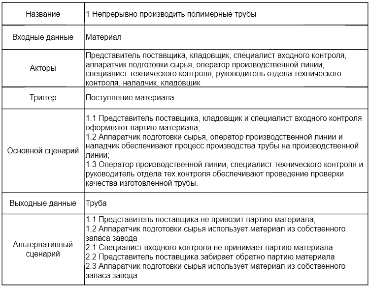
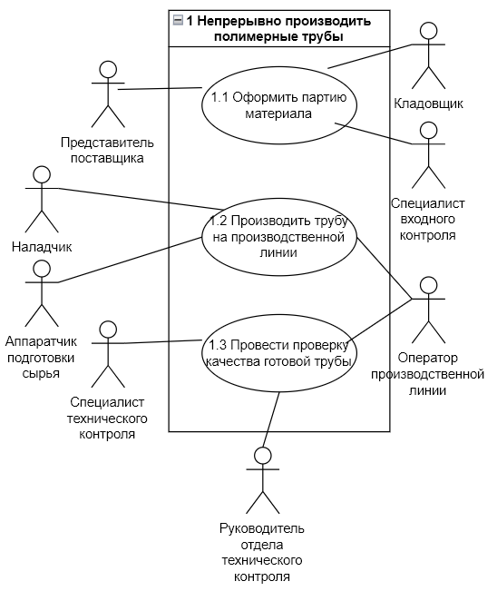
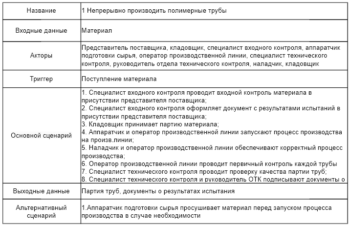

# Business Process Analysis: Polymer Pipe Production

## Описание проекта
Курсовой проект, посвященный анализу и моделированию бизнес-процесса непрерывного производства полимерных труб.

---

## Задачи
1.	Проанализировать предметную область и структуру производственного процесса, рассмотрев основноой и вспомогательный процесс. 
2.	Построить ER-диаграмму по фрагменту текстового описания.
3.	Описать бизнес-процесс (основной и вспомогательный) с использованием BPMN.
4.	Выделить ключевых участников и их взаимодействие (Use Case) 

---
## ER-диаграмма

  

---
## BPMN диаграмма

---

## Use Case диаграмма
### Первый уровень

  

  

## Второй уровень

## Третий уровень
.png)
_description.png)

.png)
_description.png)

.png)
_description.png)

---

## Структура репозитория
- `report.docx` — полный текст курсовой работы  
- `diagrams/` — ER, BPMN, Use Case диаграммы и описания к ним 
